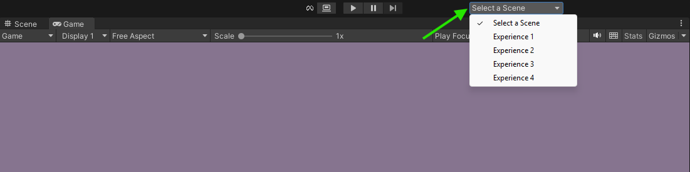
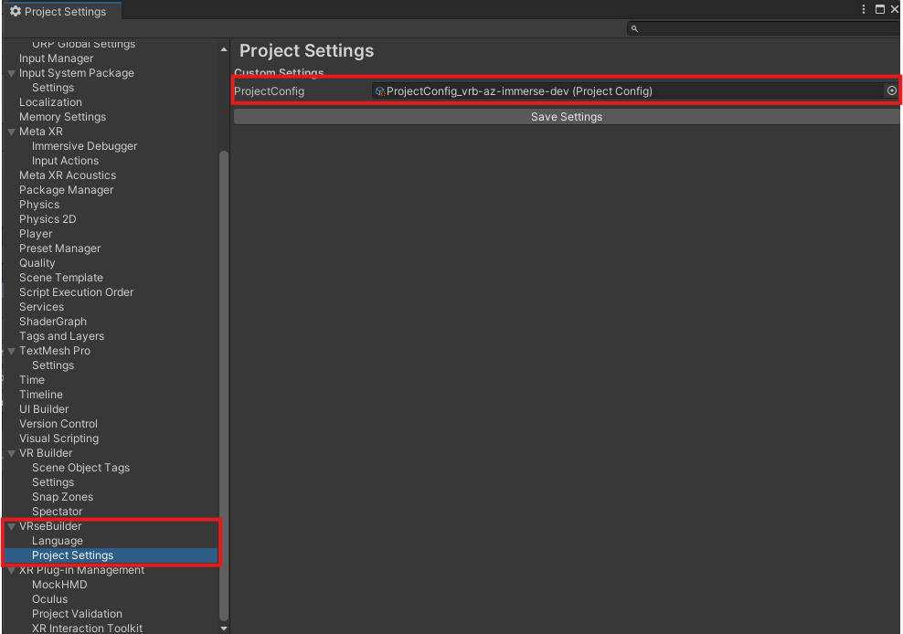
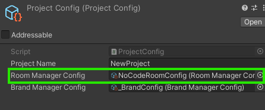
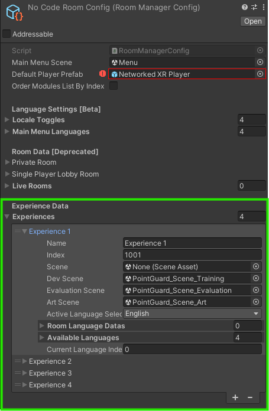

# VRSE Experience Switcher

The **VRSE Experience Switcher** is a custom Unity Editor extension that adds a convenient dropdown to the Unity Editor toolbar. It allows developers to quickly switch between different "experiences" (scenes) defined in the project configuration without manually browsing through the scene files.

## Features

- Dropdown menu in the Unity Editor toolbar for selecting scenes
- Automatically loads both **Development** and **Art** scenes (additively)
- Reflects the currently active scene in the dropdown
- Handles scene changes and Play mode transitions gracefully
- Automatically refreshes scene list based on the project configuration (Room Manager)

## Requirements

- Unity Editor (2022.3 or newer recommended)
- Project must define experiences in the `ProjectConfig` with valid dev and art scenes
- Namespace: `VRseBuilder.Core.Utility`

## How It Works

The script adds a UI element to the right-aligned area of the Unity toolbar. It populates the dropdown with scene names from the project configuration and allows the user to switch between them with a single click.

## Installation

1. Place the script in an `Editor` folder inside your project (e.g., `Assets/Editor/VrseExperienceSwitcher.cs`).
2. You can install it through package manager using add by git url with the following URL: {Add URL here later}
3. Make sure that project config for your project has been added in VRseBuilder Project Settings. Don't forget to press Save Settings button

4. Make sure correct Dev and Art Scenes are added in Experiences List of RoomManager that is assigned in Project Config

3. Open or reload the Unity Editor to see the dropdown appear in the top toolbar.

## Usage

1. Open Unity Editor.
2. Wait for the dropdown to appear on the top-right of the toolbar.
3. Use the dropdown to select an experience.
4. The selected experience’s development and art scenes will be loaded automatically.

> 💡 The dropdown is disabled during Play mode.

## Notes

- The script listens for changes to the active scene and updates the selection accordingly.
- Scenes are only switched if the current scenes are saved (user is prompted).
- If the scene paths are missing or invalid in the config, an error is logged.

## Troubleshooting

- **Dropdown not showing?**
  - Ensure the script is inside an `Editor` folder.
  - Try reopening the project
- **Dropdown is not populated correctly or is empty**
  - Make sure experiences list in `roomManagerConfig` is populated and valid.
- **Scene not switching?**
  - Check that the experience contains valid `devScene` and `artScene` paths.

## License
Developed by **Venkat Swaraj Goli**.

This tool is provided as-is under your project's license. Modify freely to suit your development pipeline.
